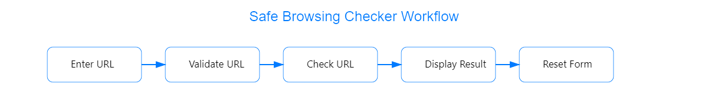

# Safe Browsing Checker

## Overview

The Safe Browsing Checker is a web application designed to check URLs against Google’s Safe Browsing API to identify potential security threats such as malware and social engineering attacks. It provides a user-friendly interface for entering a URL, validating its format, and displaying results based on the threat detection.

## Features

- **User Input**: Allows users to enter a URL in a text input field.
- **URL Validation**: Automatically corrects URL format issues and validates the URL.
- **API Integration**: Checks the URL against Google’s Safe Browsing API v4 to identify threats.
- **Results Display**: Shows whether the URL is safe or detected as a threat, with a progress bar indicating the result.
- **Reset Functionality**: Provides a button to clear the input field, results, and progress bar for a new URL check.

## Technical Stack

- **HTML**: Structuring the web page with input fields, buttons, and result display.
- **CSS**: Styling the page with a modern look, including animations and visual feedback.
- **JavaScript**: Handling user interactions, URL validation, API requests, and result display. Utilizes Axios for HTTP requests.

- **Google Safe Browsing API**: Integrates with the API to check URLs for threats.
- **Axios**: Used for making HTTP requests to the Google Safe Browsing API.
- **URL**: Used for URL validation and manipulation.
- **Progress Bar**: Utilizes a library for displaying a progress bar indicating the result.
